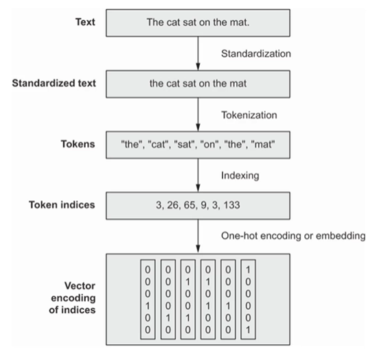

# Makine Dili ve Doğal Dil

- Bilgisayar biliminde Python, Java gibi programlama dilleirne **makine dili** denir. Bu dillerde kurallar tanımlanır ve kurallar kullanılmaya başlanır.

- İngilizce, Türkçe gibi dillere bişgisayar biliminde **doğal dil** denir. Makine dillerinden farklı olarak, insanlar önce bu dili konuşur sonra bu diller ile ilgili kurallar konur. Dolayısıyla insan dilleri bir biyolojik organizma gibi glişir. 

- Makine dilleri kesin kurallar içerirken, insan dilleri kural tanımadan başıbozuk olarak gelişir. Bu yüzden doğal diller için algoritma oluşturmak oldukça zordur. 

# NATURAL LANGUAGE PROCESSING (NLP)

### Veri Ön İşleme 

Derin öğrenme modelleri sadece sayısal verileri (tensorleri) kabul eder.
Metiler sayısal verilere çevrilmeli: 

1) Standartlaştırma yapılır.
    - Metinleri küçük harfe çevirme.
    - Noktalama işaretlerini kaldırma.
    - Veri ön işleme için kullanılan diğer bir yöntem: **STAMMING**'dir.
        * Kelimelerin kök formları ile çalışmak için kullanılır.
        * Örneğin: "koşmak", "koşuyor", "koştu" -> "koş"

2) Metinler token denen en küçük birimlere ayrılır. 
    - Bu token; karakter, kelime veya kelimlerin bir grubu olabilir.
    - Bu işleme tokenlaştırma (tocanization) denir.
    - Kelime bazlı tokenization: 
        * Her bir token boşluklara göre parçalanır. 
        * Kelimelerin sırasını dikkate alarak bir dizisel model kurulacaksa bu yöntem tercih edilir. 
    - n-gram tokenization: 
        * Art arda gelen n kelime gruplandırmadır. 
        * "büyük düşün" ya da "cep telefonu" -> 2-gram tokenlar
        * Kelimelerin sırasını dikkate alınmayacaksa (back off words) bu yöntem tercih edilir. 
    - Karakter bazlı tokenization:
        * Her bir karakter bir tokendır. 
        * Bu yöntem pratikte nadiren kullanılır. 
    - Genellikle kelime bazlı veya n-gram tokenization yöntemleri kullanılır. 

3) Her bir token sayısal vektörlere çevrilir. 
    - Bu genellikle tüm tokenların indekslenmesiyle olur. 
    - Eğitim verilerindeki tüm tokenlara bir indeks verilir, buna **Vocabulary** (Sözlük) denir. 
        * Sözlük oluşturulurken genellikle eğitim verisindeki en çok tekrar eden 20 bin veya 30 bin kelime kullanılır. Modelin eğitimini kolaylaştırmak için. 
    - Sözlükte olmayan bir kelimeyle karşılaşılırsa, bu **"out of vocabulary"** ile ifade edilir. Bu genellikle **"index 1"** ile gösterilir. Bunun anlamı; burada bir kelime var ama bu kelime sözlükte yok. 
    - Bu indeksleme yapıldıktan sonra metinler sayısal temsillere dönüştülmüş olur. 

    - **"Index 0"**, cümle uzunluklarını eşitlemek için eklenen "padding" (doldurma) değerini ifade eder; yani gerçek bir kelimeye karşılık gelmez.

* **TextVectorization** Katmanı: 
    - Veri ön işleme adımlarını, hızlıca yapmak için bize yardımcı olur. 
    - Diğer bir avantajı, data pipeline'larda ya da model içerisinde direkt kullanabilmemizdir. 
    - Bu katman normalde CPU'da çalışır. Bu katman, tek başına kullanılırsa, modelimiz GPU'yu kullansa bile bu fonksiyon CPU'da çalışacağı için eğitim yavaş olur. 
    - TextVectorization-TensorFlow.ipynb dosyasında:
        * TensorFlow’un Python 3.13 için henüz destek sunmamasından kaynaklı. Python 3.10 için bir ortam kullanılmıştır.
        

----

DUYGU ANALİZİ İÇİN AŞAMALAR
* Metin Ön İşleme 
* Metin Görselleştirme 
* Sentiment Modellemesi 
* Hiperparametre Optimizasyonu 

KÜTÜPHANELER
- pip install nltk
- pip install textblob
- pip install wordcloud
- pip install nltk

Bu repoda NLP alanında yapılan projeler readme dosyaları ile birlikte yer almaktadır.
